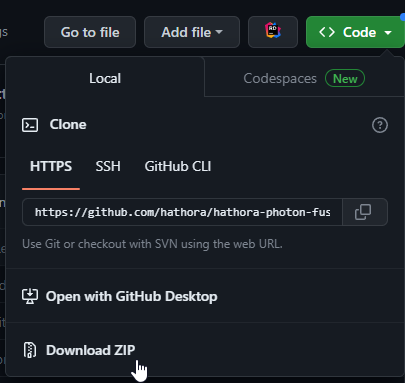
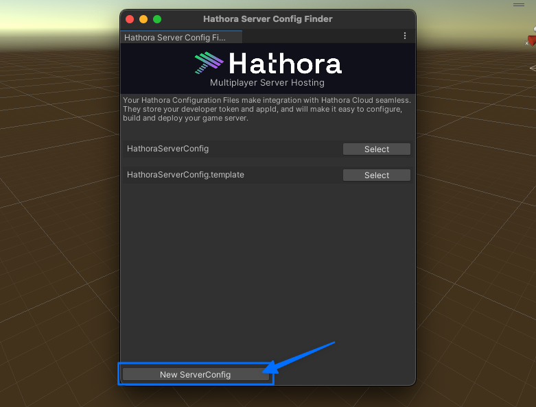
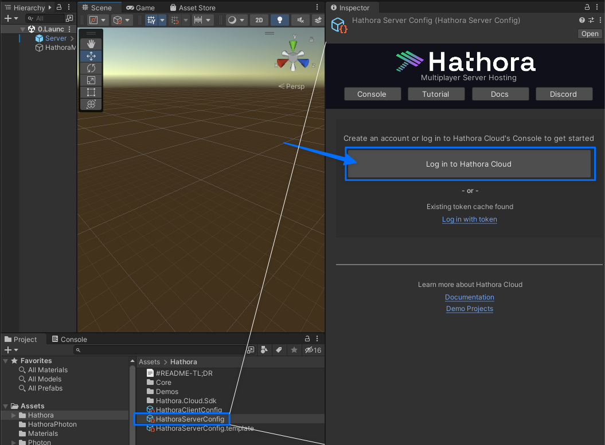
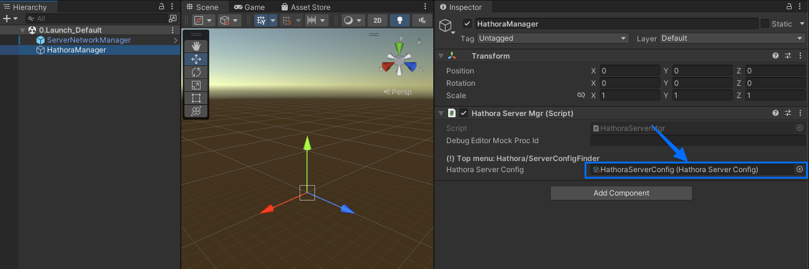

# Hathora Cloud + Photon Fusion Dedicated Server

 

### About

This minimalist technical demo was started from Photon's [Fusion Dedicated Server Sample](https://doc.photonengine.com/fusion/current/technical-samples/dedicated-server/fusion-dedicated-server) and assumes familiarity with the associated Photon Fusion [Dedicated Server Docs](https://doc.photonengine.com/fusion/current/technical-samples/dedicated-server/fusion-dedicated-server).

  

### Photon Fusion on Hathora Cloud

We have added integration to deploy a Photon Fusion dedicated server on Hathora Cloud. By deploying your Photon Fusion game on Hathora Cloud you unlock all the benefits of dedicated servers (cheat protection, improved latency, more stable connections), while also gaining scalability and access to [10+ global regions](https://hathora.dev/docs/faq/scale-globally) that map nicely with Photon Cloud's regions. And of course, you still get to take advantage of all of Photon Fusion's excellent netcode features.

This example makes sure to establish a direct connection between the dedicated server and the game clients, which ensures optimal performance for your players.

To learn more about the benefits and features of Hathora Cloud, check out our [Hathora Cloud Documenation](https://hathora.dev/docs).
  

---
## Contents

- [Getting started](#getting-started)
	-  [Requirements](#requirements)
	-  [Deploy and run steps](#deploy-and-run-steps)
- [Integration steps](#integration-steps)
- [Further integrations](#further-integrations)
- [Troubleshooting](#troubleshooting)
- [Community](#community)
- [Other samples](#other-samples)

---
 

## Getting started
### Direct download

 - Select [Code](https://github.com/hathora/hathora-photon-fusion-dedicated-server) and select the 'Download Zip' option.  Please note that this will download the branch you're currently viewing on Github.

 
  

### Requirements

- This sample game is compatible with the latest Unity Long Term Support (LTS) editor version, currently [2021 LTS](https://unity.com/releases/2021-lts). Please include **Linux Dedicated Server Build Support** in your installation, as well as **Linux Build Support (Mono)**.

- [Photon account](https://www.photonengine.com/fusion) with an active app created (for `AppId`).

- [Hathora Cloud account](https://console.hathora.dev) with an active app created (for `AppId`).
  

### Deploy and run steps

1. Create a Fusion AppId in the [PhotonEngine Dashboard](https://dashboard.photonengine.com/) and paste it into the `App Id` Fusion field in the Real Time Settings (reachable from the Fusion menu)
2. Create a Hathora Server Config file
	- This file will streamline your server deploiyment and integration with Hathora Cloud

3. Connect your Hathora Cloud account with the Hathora Unity plugin
	- If you don't have an account, create one here: [https://console.hathora.dev](https://console.hathora.dev)

4. Serialize the `HathoraServerConfig` file you created to the `0.Launch_Default` scene's `HathoraManager.HathoraServerConfig` GameObject component.

5. Use the Hathora Unity plugin to configure, build, and deploy your server on Hathora Cloud.
	1. Select the Hathora application (if you don't have one yet, [create one here](https://console.hathora.dev/application/create))
	2. Generate a server build
	3. Deploy to Hathora Cloud
	- For detailed steps on this process, check out our guide on getting started with [Hathora's Unity Plugin](https://hathora.dev/docs/engines/unity/beginners-tutorial).

4. Once deployed, create a room in Hathora Cloud:
    - via Hathora Unity plugin: Click "Create Room" button in the "Create Room" section
    - via [Hathora Console](https://console.hathora.dev): Select your application then find the "Create Room" button in the top right corner
    - Note: Creating a room in Hathora Cloud will spin up a new server instance, which will host a single match or session. Read more about [rooms in Hathora Cloud](https://hathora.dev/docs/concepts/room-lifecycle).

5. Play the `Menu` scene (in your local Editor or a standalone Client build) click the `Client` button in the loaded Lobby scene.
    - If you are in the Editor, ensure your `ServerNetworkManager.HathoraPhotonServerMgr` GameObject component script is set to `Client` (default).
    - You can then view your active connection, logs, and metrics in your Hathora Console

  

## Integration steps

The core changes needed to integrate your game with Hathora Cloud is minimal.

### Step 1: Add the Hathora Cloud Unity Plugin to your project

See Hathora Cloud Unity Plugin [download and install steps](https://github.com/hathora/unity-plugin). Note: when installing, you can exclude the `Demos` folder.

Once you have the plugin installed you will have access to:
- Hathora Cloud Unity SDK: `/Assets/Hathora/Hathora.Cloud.Sdk`
- Hathora Unity plugin & wrapper code: `/Hathora/Core`

Refer to the steps above to create and configure your `HathoraServerConfig` file.

### Step 2: Add a Hathora-Photon Server Manager

1. Create server manager like: [Asssets/HathoraPhoton/HathoraPhotonServerMgr.cs](https://github.com/hathora/hathora-photon-fusion-dedicated-server/blob/main/src/Assets/HathoraPhoton/HathoraPhotonServerMgr.cs). This manager will register your Hathora server instance with Photon Cloud via `StartArgs` (needed to establish a direct connection).
    - At `Awake()`, if deployed headless Server, subscribe to `HathoraServerMgr.OnInitialized` event, returning [HathoraServerContext](https://github.com/hathora/hathora-photon-fusion-dedicated-server/blob/46ce7b20c71b91c5debca50d2de390c595a96752/src/Assets/Hathora/Core/Scripts/Runtime/Server/Models/HathoraServerContext.cs#L16).
    - At `OnInitialized()`:
        * Set Photon's Config `containerPort` (renamed from `port`) to HathoraServerContext's `Port` (default `7777`).
        * Set Photon's Config `PublicIp` and `PublicPort` from `HathoraServerContext`.
        * Continue as normal to `base.StartSimulation()`.

2. Add manager to `Assets/Scenes/0.Launch_Default`
    - Added `HathoraManager` GameObject with `HathoraServerManager` script component to get ip:port info at `OnInitialized()` (mentioned above).
        * **(!)** Be sure to add your `HathoraServerConfig` file here as well (needed to get your selected Hathora `AppId` and your Hathora developer token.

## Further integrations

### Region Mapping

Although unused in this demo, we have included [HathoraRegionMap.cs](https://github.com/hathora/hathora-photon-fusion-dedicated-server/blob/main/src/Assets/HathoraPhoton/HathoraRegionMap.cs) to map the following Photon<>Hathora regions:

**<< Photon : Hathora >>**
- "us" : Washingington DC
- "usw" : Seattle
- "asia" : Singapore210
- "jp" : Tokyo
- "eu" : Frankfurt
- "sa" : SaoPaulo
- "kr" : Singapore

Should you choose to touch Region specifics later, this should prove useful!

### Dockerfile launch args (server command line arugments)

These arguments can be edited in your game's Dockerfile. The Hathora Unity plugin generates a Dockerfile for you the first time you generate a server build. To view your generated Dockerfile, click `Open Dockerfile` from the "Server Build Settings" section of the Hathora Unity plugin.

From the [official docs](https://doc.photonengine.com/fusion/current/technical-samples/dedicated-server/fusion-dedicated-server):

**Unity Required Args**

- `-batchmode` | Unity arg to run as headlesss server.
- `-nographics` | Unity arg to skips shaders/GUI; requires `-batchmode`.

**Photon Optional Args**

- `-session <custom session name>` | Start a Game Session with name my-custom-session. Default is a random GUID.
- `-region <region ID>` | Connect to Region US. Default is Best Region.
- `-lobby <custom lobby name>` | Publish the Game Session on the Lobby named my-custom-lobby. Default is ClientServer Lobby.
- `-port <custom port number>` | Bind to port 30001. Default is 27015.
- `-P <property name> <value>` | Setup the custom properties map = city and type = free-for-all. Default is an empty list.

**Hathora Optional Args**

- `-mode server` | Legacy from other projects to automatically start in `Server` mode; does not natively affect anything since Photon handles this for you.

## Troubleshooting
### Bug Reporting
- Report bugs in the sample game using Github [issues](https://github.com/hathora/hathora-photon-fusion-dedicated-server/issues).

### Common Issues
1. **Issue:** `InvalidOperationException: Failed to load the global config from "NetworkProjectConfig"`
    - **Caught:** Known Photon issue - your `NetworkProjectConfig` is desync'd. 
    - **Resolution:** Open this ScriptableObject -> click "Rebuild Object Table" button at top.

2. **Issue:** `Crashes in the editor often` / `TypeLoadExceptions on play (error spam in logs)`
    - **Caught:** Known Photon issue - likely for the use of native *Cecil* dlls injecting/disposing net code back and forth: Going too fast can cause permanent desyncs (for the session) with Unity.
    - **Resolution:** Simply restart your Editor.

3. **Issue:** `When debugging with breakpoints after a connection is started, my IDE just suddenly stops debugging`
    - **Caught:** known Photon issue - due to the way timeouts are handled (classes are seemingly just disposed, interrupting the debugging threads).
    - **Resolution:** TODO: There is likely a way to lower or disable this timeout, which would be more-ideal for development builds.

4. **Issue:** `When I try to test as a Client in the Editor, I simply get No 'Cameras Rendered'`
    - **Caught:** You were probably mocking a Server in the `0.Launch_Default` scene, where `ServerNetworkManager.HathoraPhotonServerMgr` is set to `Server`.
    - **Resolution:** In `0.Launch_Default` scene, set `ServerNetworkManager.HathoraPhotonServerMgr` GameObject component script to `Client` (default).
  
### Documentation
- For a deep dive into Hathora Cloud, visit our [documentation site](https://hathora.dev/docs).
- Learn more the [Photon Dedicated Server Demo](https://doc.photonengine.com/fusion/current/technical-samples/dedicated-server/fusion-dedicated-server).

  

## Community
For help, questions, advice, or discussions about Hathora Cloud and its samples, please join our [Discord Community](https://discord.gg/hathora). We have a growing community of multiplayer developers and our team is very responsive.
  

## Other samples
### Hathora Unity Plugin
[Hathora Unity Plugin (with FishNet and Mirror demos)](https://github.com/hathora/hathora-unity) is our Unity Plugin that comes with FishNet and Mirror networking demos. It allows you to deploy your game on Hathora Cloud directly from our editor plugin.

### Unity NGO Sample
[@hathora/unity-ngo-sample](https://github.com/hathora/unity-ngo-sample) takes Unity's 2D Space Shooter sample game with *Unity NetCode for Game Objects* (NGO) and modifies it to be easily deployable on Hathora Cloud.
  
